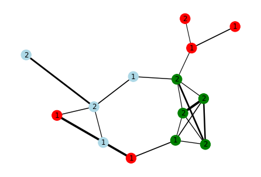

# Stylometric-based authorship for single and multi-authored documents

We explore an stylometric-based feature-engineered approach for authorship classification in different datasets. For multi-author documents we employ the stylometric features to build a graph based on document-similarity, where documents that share similar style portions are linked. 

## Datasets

- [Reuter 50_50 Dataset](https://archive.ics.uci.edu/ml/datasets/Reuter_50_50)   
Single-authored articles published in Reuters from 50 different authors. 
- [Gutenberg Project](https://www.gutenberg.org/)
  Freely available ebooks. Sub-set of single-authored and written in English books. 
- [Computation and Language (cs.CL) arXiv preprints from 2021](https://arxiv.org/)
  Downloaded using a simple ArXiv scrapper and parsed with Apache Tika.

To test our methods, we have employed a subsample of three authors for each datasest. In the case of ArXiv preprints, mostly multi-authored, we choose three authors and used all documents in which any of these authors was either first or second author. 

## Methods

Each sample (document) is divided into several chunks, out of which we extract a stylometric vector containing both, syntactical and semantic features. This is done in part to avoid chunks that do not follow the main style of the document, as can be quotes or equations, of having any important contribution to the feature vector. 

When building the chunks, a certain overlap is also introduced, as these vectors better capture style when the input text/chunk is larger. This limitation will impact the performance on the Reuter's dataset, where the texts are generally quite brief. 

Finally, we apply PCA to the computed feature vectors.

### 1. Single-authored documents

We employ two different clustering approaches: 

- **K-Means**  
Use all feature vectors and compute the $n$ clusters with K-Means. Since each point is a text chunk, when classifying a document we simply assign it the cluster where the majority of its text chunks lie. Alternatively, this can easily generalized into a probabilistic prediction. In addition, instead of K-Means, an unsupervised clustering algorithm could be use, thus making the whole approach completely unsupervised. 
- **Point-clouds + Hausdorff distance**  
Instead of using the individual chunks, we can build a point cloud for each document by simply using all its chunks as single points. We can then measure the distance between each document by measuring the Hausdorff distance between each point-cloud, and cluster them according to these distances. 

### 2. Multi-authored documents 

The previous methods could also be used, in principle, to multi-authored documents. One would simply have to interpret each cluster as either a group of authors with similar style, or a single one, without actually knowing this. However, in a multi-authored document, its (chunk) feature-vectors can be more spread (assuming we are capturing different style from different authors), and assigning an author or authors to a document becomes definitely more difficult. We could also potentially be losing much more information. 

Instead, we can create a _document_ graph, where each node is a document, and establish edges based on fragment similarity, capturing in this way the various similarities that a document can present due to diverse authors. Here we will be following mainly [Sarwar et al. (2019)](https://wlv.openrepository.com/handle/2436/623699) and the method they present for building the graph. _(A bit more technically, instead of using the chunks, we use groups of chunks, which they called fragments. These fragments are essentially point clouds, onto which we can apply the previous method employing again the Hausdorff distance.)_

## Results

In the folder [notebooks](https://github.com/Mi-CS/stylometric_features/tree/master/notebooks), examples for the three datasets and its results can be found. A summarize of the example results are as follow: 

- **Reuters dataset**  
The method does not properly work, either with this particular style or, as we think is the most probable case, because of the shortness of the articles. For the 3-authors subset, total accuracy is always below 50% and the f1-score for all the authors is poor, below 0.5 in all cases. 

- **Gutenberg project**  
For the 3-author subset, K-Means achieve 65% of accuracy, with two authors clearly overlapping in the feature space, as the measurements indicate. The *point_cloud* method achieves a good performance with an overall accuracy of 82% and f1-scores for individual authors between 0.7 and 0.9. 

- **ArXiv cs.CL preprints**  
As we took a subset of 14 papers with 3 main authors, we tried both, the single-author document and multi-author document approaches: 
  - **Single-author approach.** K-Means also fair poorly here, but with the *point_cloud* we are able to achieve 0.7% of overall accuracy. However, with a closer inspection, we see that one of the authors present a poor recall of 0.2, and a second one a precision of 0.56, leaving a lot of room for improvement. 
  - **Multi-author approach.** Following the aforementioned approach, we obtain the following graph (see notebook for more details): 
 

  Each color is one main author, the node number indicates whether s/he is the first or second author of the paper, and the edge width is proportional to the number of close fragments between them. 